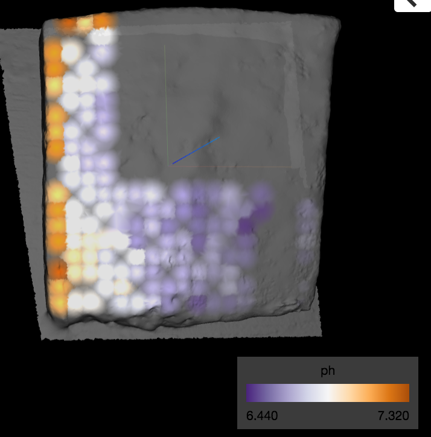

# cheese-molecular-cartography

See some of molecular maps of cheese here:

[pH](https://ili.embl.de/?http://github.com/lfnothias/cheese-molecular-cartography/raw/master/3D_model/20160719130338_v2.stl;http://github.com/lfnothias/cheese-molecular-cartography/raw/master/ili_table/ili2_cheese.csv;https://github.com/lfnothias/cheese-molecular-cartography/raw/master/molecular_snapshots/ph.json)

[log(Brachybacterium_Lactobacillus)](https://ili.embl.de/?http://github.com/lfnothias/cheese-molecular-cartography/raw/master/3D_model/20160719130338_v2.stl;http://github.com/lfnothias/cheese-molecular-cartography/raw/master/ili_table/ili2_cheese.csv;https://github.com/lfnothias/cheese-molecular-cartography/raw/master/molecular_snapshots/log(Brachybacterium_Lactobacillus).json)

[log(Brevibacterium_Lactobacillus)](https://ili.embl.de/?http://github.com/lfnothias/cheese-molecular-cartography/raw/master/3D_model/20160719130338_v2.stl;http://github.com/lfnothias/cheese-molecular-cartography/raw/master/ili_table/ili2_cheese.csv;https://github.com/lfnothias/cheese-molecular-cartography/raw/master/molecular_snapshots/log(Brevibacterium_Lactobacillus).json)

[log(Corynebacterium_Lactobacillus)](https://ili.embl.de/?http://github.com/lfnothias/cheese-molecular-cartography/raw/master/3D_model/20160719130338_v2.stl;http://github.com/lfnothias/cheese-molecular-cartography/raw/master/ili_table/ili2_cheese.csv;https://github.com/lfnothias/cheese-molecular-cartography/raw/master/molecular_snapshots/log(Corynebacterium_Lactobacillus).json)

[log(Disulfide_3-methyl-butanal)](https://ili.embl.de/?http://github.com/lfnothias/cheese-molecular-cartography/raw/master/3D_model/20160719130338_v2.stl;http://github.com/lfnothias/cheese-molecular-cartography/raw/master/ili_table/ili2_cheese.csv;https://github.com/lfnothias/cheese-molecular-cartography/raw/master/molecular_snapshots/log(Disulfide_3-methyl-butanal).json)

[log(Methionine_RecA).json](https://ili.embl.de/?http://github.com/lfnothias/cheese-molecular-cartography/raw/master/3D_model/20160719130338_v2.stl;http://github.com/lfnothias/cheese-molecular-cartography/raw/master/ili_table/ili2_cheese.csv;https://github.com/lfnothias/cheese-molecular-cartography/raw/master/molecular_snapshots/log(Methionine_RecA).json)

[log(Trisulfide_3-methyl-butanal)](https://ili.embl.de/?http://github.com/lfnothias/cheese-molecular-cartography/raw/master/3D_model/20160719130338_v2.stl;http://github.com/lfnothias/cheese-molecular-cartography/raw/master/ili_table/ili2_cheese.csv;https://github.com/lfnothias/cheese-molecular-cartography/raw/master/molecular_snapshots/log(Trisulfide_3-methyl-butanal).json)
